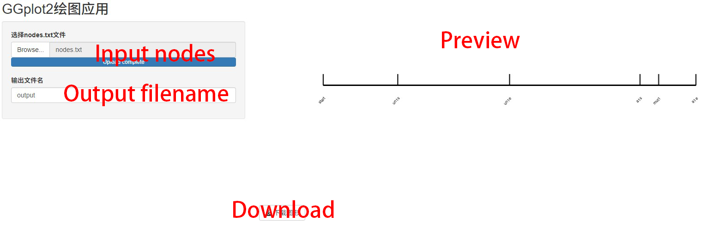

This is a simple app for producing segment plot. It can be a convenient scale for drawing diagrams (e.g. gene structure, protain domains).

The input nodes should be a tab-delimited text file, in which the first column is the names of the nodes and the second column is the absolute coordinate (e.g. the base or the amino acid count) of the notes. The order of the nodes will be placed correctly and the coordinate will be normalized to a constant total length.
