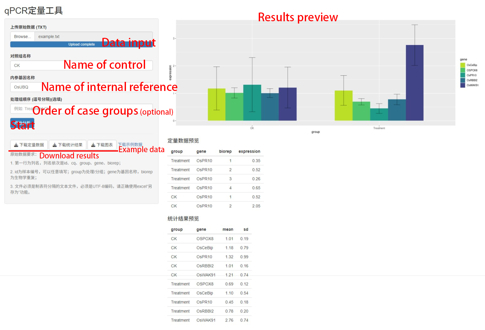

Inspired by https://github.com/lixiang117423/qPCRtools (publication: https://www.frontiersin.org/articles/10.3389/fgene.2022.1002704/full).

**Note:** There's an error in the origin code of `qPCRtools` and it has been corrected. See https://github.com/lixiang117423/qPCRtools/issues/5.

